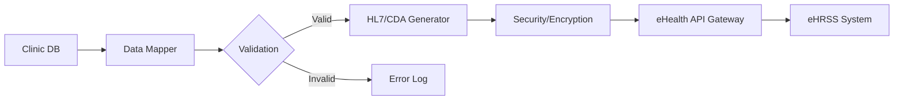

# 香港 eHealth 集成開發文檔 (eHealth Integration Guide)

本文件基於香港 eHealth (eHRSS) 開發者門戶指南及公開技術標準編寫，旨在指導將現有診所系統與香港 eHealth 系統集成，以上傳病人電子病歷 (EMR)。

## 1. 項目概述 (Project Overview)

*   **目標**: 實現診所管理系統 (CMS) 與香港 eHealth 互通，支持上傳病人就診記錄、診斷、藥物處方等數據。
*   **主要功能**:
    1.  身份驗證 (Authentication)
    2.  數據轉換 (Data Transformation to HL7/CDA)
    3.  數據上傳 (Data Upload)
    4.  錯誤處理與重試 (Error Handling & Retry)
    5.  審計日誌 (Audit Logging)

## 2. 系統架構 (System Architecture)

建議在現有系統中增加一個獨立的 `eHealth Integration Module`，負責所有與 eHealth 的交互。

## 3. 技術標準 (Technical Standards)

*   **數據格式**:
    *   **HL7 v2.x**: 用於病人行政數據 (Patient Administration) 及部分臨床數據。
    *   **HL7 CDA (Clinical Document Architecture)**: 用於臨床文檔 (如 Discharge Summary, Referral Letter)。
    *   **FHIR**: 新一代標準 (具體需確認 eHealth 最新支持情況，主要用於移動端或新接口，核心上傳仍多用 CDA)。
*   **編碼系統 (Code Systems)**:
    *   **eHR Codex**: 香港特有的醫療編碼標準 (需從 Self-Service Kit 獲取)。
    *   **ICD-10**: 診斷編碼。
    *   **SNOMED CT**: 臨床術語 (視乎要求)。
    *   **LOINC**: 檢驗編碼。

## 4. 開發流程 (Development Process) - 基於 "4 Easy Steps"

### 第一步：準備與學習 (Preparation) - 針對服務供應商 (Service Provider)
1.  **確認身份**:
    *   您是 **電子健康紀錄服務供應商 (eHR Service Provider, SP)**，即為醫護機構開發系統的技術合作夥伴。
    *   **不需要** 像診所/醫院那樣申請「醫健通醫護機構 (HCP)」資格。
    *   您的目標是開發符合 eHealth 標準的 **CMS On-ramp** 系統，並通過測試成為認可的服務供應商。

2.  **電子健康紀錄服務供應商培訓計劃 (SP Training Scheme)**:
    *   **官方網頁**: [電子健康紀錄服務供應商培訓計劃](https://www.ehealth.gov.hk/tc/healthcare-provider-and-professional/resources/training-and-seminars/eHR-service-provider-training-scheme.html)
    *   **目的**: 這是 eHealth 專為 IT 供應商設立的計劃，提供開發 **CMS On-ramp** (診所管理系統連接部件) 所需的技術規格和支援。
    *   **重要性**: 參與此計劃通常是成為認可供應商及獲取最新技術文檔的官方途徑。既然您手頭已有 `Self-Service Kit`，您可能已經是此計劃的參與者或透過相關渠道獲得了資料。

3.  **檢視本地 Self-Service Kit**: 位於 `c:\Repo\ehealth\Self-Service Kit`。
    *   **Step 2.1**: **Test Environment Setup Application Form v1.5.docx** (測試環境申請表)。
        *   **行動**: 作為供應商，您需要填寫此表格來申請連接到 eHealth 的測試環境 (Stage Environment)。
    *   **Step 2.2**: **eHR Codex Table.xlsx** (核心編碼表，開發必備)。
    *   **Step 2.2 & 3.1**: DCT 測試用例文檔 (詳細描述了各個模塊如 Allergy, Diagnosis 的測試場景)。

4.  **申請測試環境**:
    *   打開 `Self-Service Kit\Step 2.1 - Test Environment Setup Application Form\Test Environment Setup Application Form v1.5.docx`。
    *   填寫表格：通常需要提供公司資料、擬開發的系統名稱 (CMS Name)、聯絡人技術資料等。
    *   提交方式：通常是電郵至 eHR 辦公室 (需參考表格內的提交說明)。

### 第二步：開發與自測 (Development & Self-Service Testing)
1.  **數據映射 (Data Mapping)**:
    *   打開 `Step 2.2 - eHRSS code set\eHR Codex Table.xlsx`。
    *   建立 `Mapping Table`: 將診所數據庫字段映射到 Codex 標準代碼。
        *   例如：性別 (Sex) 需映射到 Codex 中的 `EHR_SEX` 代碼。
        *   例如：藥物 (Drug) 需映射到 `HK_DRUG_CODE` 或 `HK_REG_NO`。
2.  **開發模塊 (參見 src/ehealth)**:
    *   參考 `DCT Test Cases` 文檔中的場景開發 HL7/CDA 生成邏輯。
    *   重點模塊：
        *   **PMI (Patient Master Index)**: 對應 `DCT Test Cases for PMI Record`。
        *   **Encounter**: 對應 `DCT Test Cases for Encounter Record`。
        *   **Diagnosis/Problem**: 對應 `DCT Test Cases for Problem (Diagnosis) Record`。
        *   **Medication**: 對應 `Prescribing` 和 `Dispensing` 測試用例。
        *   **Allergy**: 對應 `Allergy Record` 測試用例。
2.  **開發模塊**:
    *   實現 HL7 消息生成器。
    *   實現加密傳輸 (通常涉及 Mutual TLS, XML Encryption/Signature)。
3.  **自測 (Self-Testing)**:
    *   使用 Self-Service Kit 中的測試數據進行測試。
    *   驗證生成的 XML/HL7 消息格式是否通過 Schema 校驗。

### 第三步：數據合規測試 (Data Compliance Test - DCT)
1.  **執行 DCT 測試用例**:
    *   按照 Kit 中的 DCT 腳本，模擬真實場景 (如：新病人登記、藥物敏感上傳、診斷記錄上傳)。
    *   生成測試報告。
2.  **提交報告**: 將測試結果及生成的樣例消息提交給 eHR-IT 團隊審核。
3.  **修復反饋**: 根據 eHR-IT 的反饋修正數據格式或邏輯錯誤 (通常需 10 個工作日審核)。

### 第四步：連接生產環境 (Production Connection)
1.  **連接驗證**: 在通過 DCT 後，配置生產環境的連接參數 (URL, Certificates)。
2.  **試運行 (Pilot Run)**: 選擇少量真實數據進行上傳驗證。
3.  **正式上線 (Go Live)**: 全面啟用自動化上傳。

## 5. 關鍵功能模塊設計 (Module Design)

### 5.1 認證模塊 (Authentication)
*   **證書管理**: 存儲及加載 e-Cert (機構證書及個人證書)。
*   **Session 管理**: 處理登錄、Token 獲取及刷新。

### 5.2 數據映射 (Mapper)
*   `PatientMapper`: 轉換 PID (Patient ID, Name, DOB, Sex)。
*   `EncounterMapper`: 轉換 PV1 (Visit ID, Date, Doctor)。
*   `ClinicalMapper`: 轉換 DG1 (Diagnosis), RXE (Pharmacy), AL1 (Allergy)。

### 5.3 傳輸模塊 (Transport)
*   **Protocol**: HTTPS (TLS 1.2+).
*   **SOAP/REST**: 根據 eHealth 接口規範 (通常是 SOAP Web Services 用於舊系統，REST FHIR 用於新系統)。
*   **Retry Logic**: 網絡失敗時的指數退避重試機制。

## 6. 安全要求 (Security Requirements)
*   **數據加密**: 傳輸層 (TLS) 及消息層 (Message Level Encryption)。
*   **數字簽名**: 所有上傳數據必須使用認可的數字證書進行簽名 (Non-repudiation)。
*   **訪問控制**: 確保只有授權的醫護人員可觸發上傳操作。

## 7. 下一步行動 (Next Steps)
1.  **提交測試環境申請**: 填寫 `Self-Service Kit\Step 2.1` 下的 Word 表格並發送給 eHR 辦公室。
2.  **分析 Codex**: 打開 `Self-Service Kit\Step 2.2 - eHRSS code set\eHR Codex Table.xlsx`，確認您的數據庫中是否有對應的字段可以映射。
3.  **開始編碼**: 根據 `DCT Test Cases` 文檔的要求，修改 `src/ehealth/services/HL7MessageGenerator.js`。

---
**附註**: 由於未提供 Self-Service Kit 的具體技術文檔 (WSDL/XSD)，本指南基於通用 HL7 標準及 eHealth 公開流程編寫。實際開發中需嚴格遵循 Kit 中的規範。
